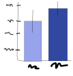

# Project title
Brief description of the project. 

This code does X.

Here is an image of the results:

## Running this code
### Data
The data can be found [here](url).

### Requirements
- Python version X
- package A version Y

### Reproducing the results
These results can be reproduced by running the following files
- file A (e.g., preprocessing)
- file B (e.g., analysis)

### Please cite us
The results are publihed in the paper Z, which can be found [here](url).
If you use this code, please cite this paper:

(BibTeX paper citation)

